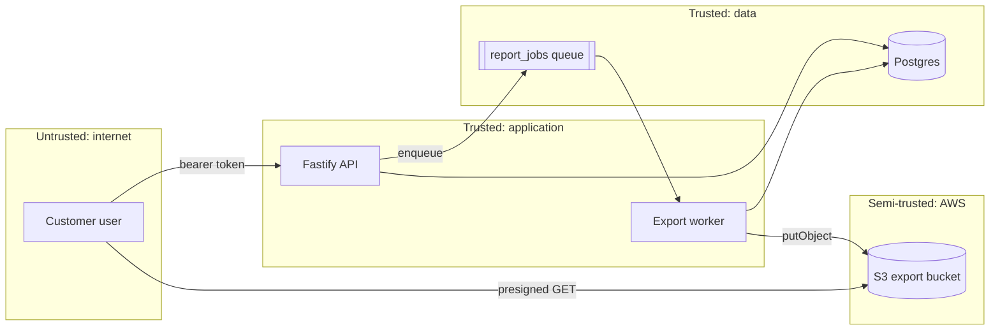

# Worked example: threat model of a multi-tenant reporting API

Abbreviated — three threats shown out of eleven. The shape and the specificity are the quality target.

---

# Threat model: reporting subsystem
2026-03-14 · ledger-api · exposure public · data credentials

## Scope

**In:** `GET /reports`, `GET /reports/:id`, `POST /reports/export`, the `report_jobs` queue and its worker, the S3 bucket exports land in.

**Out:** authentication itself (modelled separately in `2026-02-01-threat-model-auth.md`), the banking provider integration, anything under `/admin`.

**Assumed:** TLS terminates at Fly's proxy and the origin is not directly reachable. Postgres is not exposed to the internet. Neither was verified in this pass — both are in Not modelled.

## System and trust boundaries

**internet → app.** Trust changes from nothing to "an authenticated tenant." Everything the user sends is attacker-controlled, including the report id, the export filters and the pagination cursor.

**app → data.** Tenant identity must survive this crossing. Postgres has no row-level security enabled, so tenancy is enforced entirely in application queries — every query is an independent chance to get it wrong.

**app → AWS.** Exports leave the trust boundary and become objects reachable by URL. Whoever holds the URL holds the data, for as long as the URL is valid.

## Threats

### T1 — Cross-tenant report read   `GET /reports/:id` · STRIDE: E

**Attack:** An authenticated tenant A user requests `GET /reports/8831` where 8831 belongs to tenant B, and receives it. `src/routes/reports.ts:44` calls `prisma.report.findUnique({ where: { id } })` with no tenant predicate, and ids are a Postgres `serial`, so the full corpus is enumerable by counting.

**Likelihood:** High — reachable from any account with no precondition beyond a valid login, and the id space is sequential.
**Impact:** High — bulk exposure of other tenants' financial reports; raised from Medium by `data_sensitivity: financial`.
**Risk:** **Critical**

**Response:** mitigate

**Mitigation:** In `src/db/repository.ts`, add a `scopedReport(tenantId)` accessor and make `prisma.report` private to that module via an ESLint `no-restricted-imports` rule, so a handler written next year cannot reach the unscoped client at all. Fixing only `reports.ts:44` leaves the same defect available to the next handler.

---

### T4 — Export URL outlives the session   `S3 presigned GET` · STRIDE: I

**Attack:** A user exports a report and receives a presigned URL valid for 7 days (`src/jobs/export.ts:71`, `expiresIn: 604800`). The URL lands in browser history, a support ticket, and a Slack paste. Anyone holding it can fetch the export for a week, after the user has been deactivated, after their access is revoked, and without any log entry attributable to a person.

**Likelihood:** Medium — needs the URL to leak, which happens routinely but is not something the attacker controls directly.
**Impact:** High — financial data, and no revocation path short of deleting the object.
**Risk:** **High**

**Response:** mitigate

**Mitigation:** In `src/jobs/export.ts`, cut `expiresIn` to 300 seconds and stop returning the S3 URL to the client. Serve exports through `GET /reports/exports/:id` in `src/routes/reports.ts`, which re-checks the session and tenant, then streams or 302s to a freshly signed short-lived URL. This also produces an access log entry with an actor, which T7 (repudiation) needs anyway.

---

### T9 — Export worker starvation across tenants   `report_jobs` · STRIDE: D

**Attack:** A tenant enqueues 50,000 export jobs with no date filter. `src/jobs/worker.ts` pulls FIFO from a single queue with four workers, so every other tenant's exports sit behind them. No per-tenant limit exists at enqueue or dequeue.

**Likelihood:** Medium — trivially reachable by any authenticated user, but as likely to be an accident as an attack.
**Impact:** Medium — core function unavailable for other tenants, recoverable by draining the queue.
**Risk:** **Medium**

**Response:** mitigate

**Mitigation:** Cap in-flight jobs per tenant at 3 in `src/jobs/enqueue.ts`, and reject beyond a per-tenant daily quota with a 429. Fair-share dequeuing in the worker is the better fix but is a larger change; the cap is the version that ships this week.

---

## Backlog

| # | Threat | Risk | Change | File |
| --- | --- | --- | --- | --- |
| 1 | T1 cross-tenant read | Critical | scoped repository + lint guard on raw client | `src/db/repository.ts` |
| 2 | T2 cross-tenant export filter | Critical | same accessor, applied to the export path | `src/jobs/export.ts` |
| 3 | T4 long-lived presigned URL | High | 300s expiry, serve via authenticated route | `src/jobs/export.ts`, `src/routes/reports.ts` |
| 4 | T7 no export audit record | High | audit row on export request and download | `src/routes/reports.ts` |
| 5 | T9 queue starvation | Medium | per-tenant in-flight cap | `src/jobs/enqueue.ts` |

## Not modelled

- **Postgres network exposure.** Assumed private, never verified. `hardening-playbook` on the Fly config would close this.
- **The auth layer itself.** Modelled separately; T1 assumes a valid session is genuinely a valid session.
- **S3 bucket policy.** Read the code that signs URLs, not the bucket's own ACL and public-access-block settings. If the bucket is public, T4 stops mattering because everything is already worse.
- **Postgres row-level security.** Not enabled today. Turning it on would make T1 and T2 structurally impossible rather than individually fixed, and is worth costing before doing five query-level fixes.

---

## What this run got right

- Scope is bounded and the out-list is real. Auth was excluded and pointed at its own document.
- Boundaries are described in terms of what changes hands, not just drawn.
- Every threat names a file and line, and every attack sentence has a precondition and an outcome.
- Every score carries its reason, and the two impact escalations state which config key drove them.
- T1's mitigation fixes the class, not the instance, and says why explicitly.
- T9's mitigation names the better fix and ships the cheaper one, with the tradeoff visible.
- "Not modelled" includes the uncomfortable one: if the bucket is public, the model's assumptions were wrong.
